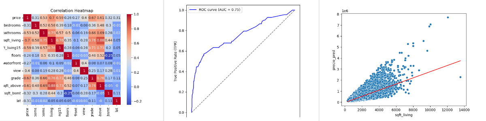
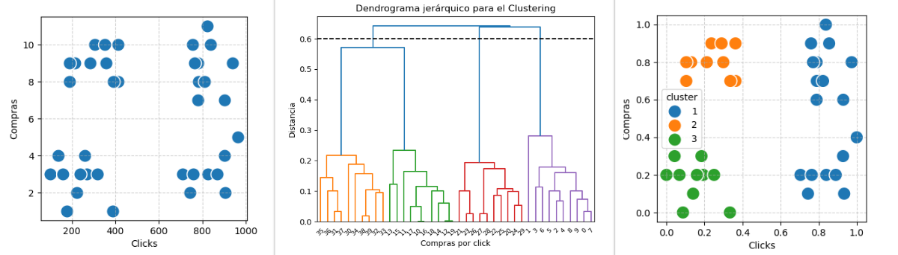
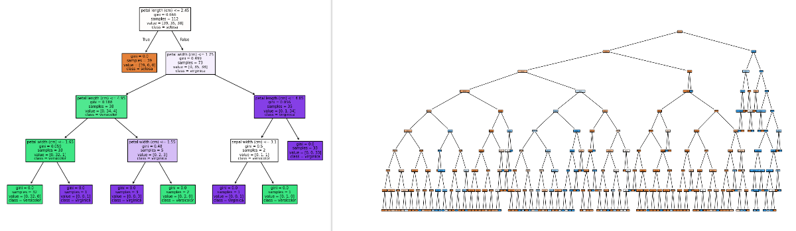

# Machine Learning

### **Description**: Machine Learning code exercises in Python.
### **Tools**: Python: Pandas, NumPy, Matplotlib, Seaborn, StatsModels, SciPy, Sklearn.
### **Results**: Successfully generated and applied common Machine Learning models to solve real-world problems:
  - Linear/Logistic Regression
  - K-Means Clustering
  - K-Nearest Neighbors (KNN)
  - Decision Trees
  - Random Forest

---