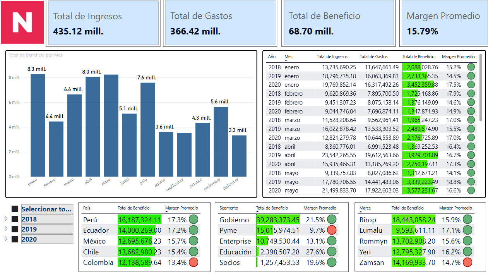
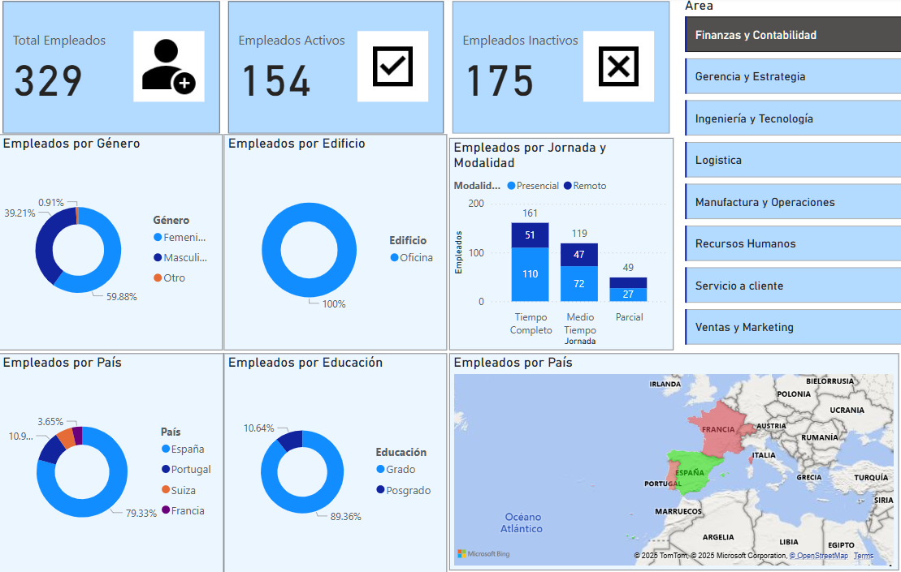
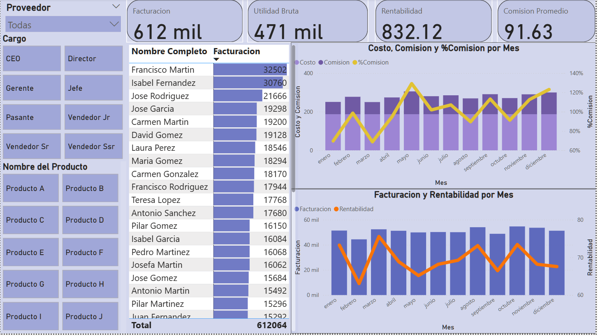

# PowerBI

- **Description**: - **Description**: Interactive dashboards developed in Power BI using DAX for advanced calculations, database connections, and custom visualizations. .
- **Tools**: PowerBI: DAX, DB Connection.
- **Results**: These dashboards provide actionable insights for sales analysis, financial reporting, and operational performance tracking.