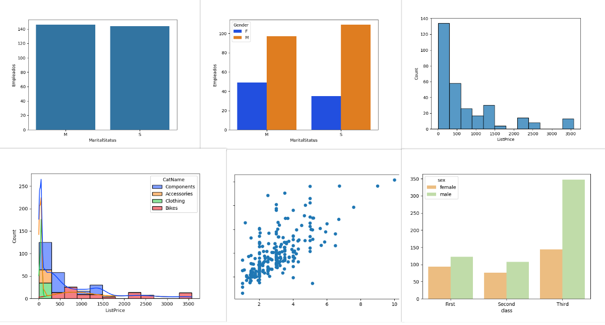

# Python

	

### **Description**: **Description**: A collection of Python coding exercises focused on data manipulation, algorithm development, and data visualization.
### **Tools**: Python: Loops/Conditionals, Data Types, Objects, Matplotlib, Seaborn, Plotly, Pyodbc, NumPy, Pandas.
### **Results**: These exercises utilize libraries to solve real-world problems and improve programming skills enabling efficient data analysis and the creation of impactful visualizations.