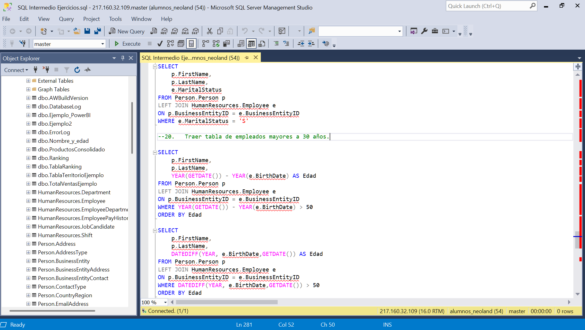
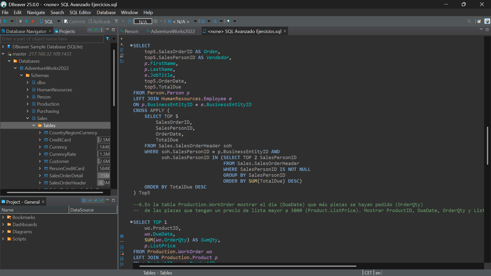

# Data-Analytics-Projects
The most outstanding projects of the Data Analytics Bootcamp at NEOLAND.

Hi! I'm Erik Eudave, a Data Analyst with experience in Python, Streamlit, R, SQL, PowerBI, Tableau and Machine Learning.
Here you'll find a collection of projects I've completed.

## Proyects

---

### 1. [Spotify-Analysis](Spotify-Analysis/) (Final Bootcamp Project)

- **Description**: Exploring the relationship between the characteristics of the most popular songs in 73 countries.
- **Machine Learning**: Generates song clusters based on their characteristics using K-Means algorithm and performs dimensionality reduction with PCA for visualization.
- **Tools**: Python, Machine Learning, Streamlit.
- **Results**: Some songs and artists are popular in multiple countries, suggesting a global trend. However, there are also songs that are popular only in specific regions. Musical characteristics such as danceability and energy are key to popularity.
- **NOTE** This project was chosen as the best within the data analytics bootcamp.

---

### 2. [PowerBI](PowerBI/)

- **Description**: - **Description**: Interactive dashboards developed in Power BI using DAX for advanced calculations, database connections, and custom visualizations. .
- **Tools**: PowerBI: DAX, DB Connection.
- **Results**: These dashboards provide actionable insights for sales analysis, financial reporting, and operational performance tracking.

---

### 3. [Tableau](Tableau/)

  
  

- **Description**: Interactive dashboards developed in Tableau using advanced calculations, database connections, and custom visualizations.
- **Tools**: Tableau: Dimensions, Measurements and Maps.
- **Results**: Powerful visualizations that provide actionable insights for sales analysis, financial reporting, and operational performance tracking.

---

### 4. [Python](Python/)

- **Description**: **Description**: A collection of Python coding exercises focused on data manipulation, algorithm development, and data visualization.
- **Tools**: Python: Loops and Conditionals, Data Types, Objects, Matplotlib, Seaborn, Plotly, Pyodbc, NumPy, Pandas.
- **Results**: These exercises utilize libraries to solve real-world problems and improve programming skills enabling efficient data analysis and the creation of impactful visualizations.

---

### 5. [Machine Learning](Machine-Learning/)

- **Description**: Machine Learning code exercises in Python implementing regression, classification, and tree models.
- **Tools**: Python: Pandas, NumPy, Matplotlib, Seaborn, StatsModels, SciPy, Sklearn.
- **Results**: Successfully generated and applied common Machine Learning models to solve real-world problems:
  - Linear/Logistic Regression
  - K-Means Clustering
  - K-Nearest Neighbors (KNN)
  - Decision Trees
  - Random Forest

---

### 6. [R](R/)

- **Description**: R programming exercises focusing on data manipulation, visualization, and statistical analysis.
- **Tools**: R: Readr, Dplyr, Tidyr, Stringr, Lubridate, Forecats, Ggplot, Plotly.
- **Results**: Achieved proficiency in R's main libraries, enabling efficient data analysis and the creation of impactful visualizations.

---

### 7. [SQL](SQL/)

- **Description**: SQL exercises designed to improve query writing and database management skills.
- **Tools**: DBeaver, Microsoft SQL Server Management Studio (SSMS), Lucid (ER Diagrams).
- **Results**: Achieved proficiency in writing efficient SQL queries and optimizing database performance, supporting data-driven decision-making.

---