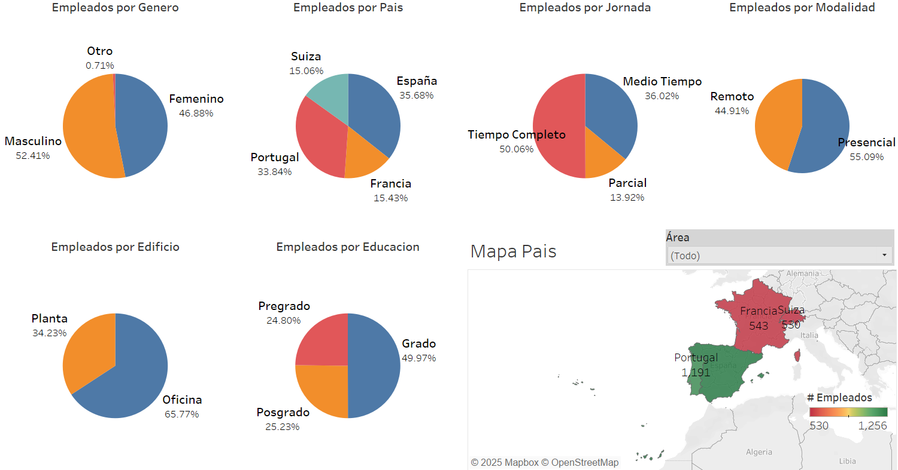

# Data-Analytics-Projects
The most outstanding projects of the Data Analytics Bootcamp

Hi! I'm Erik Eudave, a Data Analyst with experience in Python, Streamlit, R, SQL, PowerBI, Tableau and Machine Learning.
Here you'll find a collection of projects I've completed.

## Proyects

---

### 1. [Spotify-Analysis](Spotify-Analysis/) (Final Bootcamp Project)

- **Description**: Exploring the relationship between the characteristics of the most popular songs in 73 countries.
- **Machine Learning**: Generates song clusters based on their characteristics using K-Means algorithm and performs dimensionality reduction with PCA for visualization.
- **Tools**: Python, Machine Learning, Streamlit.
- **Results**: Some songs and artists are popular in multiple countries, suggesting a global trend. However, there are also songs that are popular only in specific regions. Musical characteristics such as danceability and energy are key to popularity.
- **NOTE** This project was chosen as the best within the data analytics bootcamp.

---

### 2. [PowerBI](PowerBI/)

- **Description**: Some of the dashboards generated in PowerBI using tools such as DAX and database connections.
- **Tools**: PowerBI: DAX, DB Connection.
- **Results**: Powerful visualizations that deliver valuable information in different markets by applying PowerBI's tools.

---

### 3. [Tableau](Tableau/)

  
  

- **Description**: Some of the dashboards generated in Tableau.
- **Tools**: Tableau: Dimensions, Measurements and Maps.
- **Results**: Powerful visualizations that deliver valuable information in different markets by applying Tableau tools.

---

### 4. [Python](Python/)

- **Description**: Some code exercises donde in Python.
- **Tools**: Python: Loops and Conditionals, Data Types, Objects, Matplotlib, Seaborn, Plotly, Pyodbc, NumPy, Pandas.
- **Results**: Understand and know how to use the main libraries.

---

### 5. [Machine Learning](Machine-Learning/)

- **Description**: Some Machine Learning code exercises done in Python.
- **Tools**: Python: Pandas, NumPy, Matplotlib, Seaborn, StatsModels, SciPy, Sklearn.
- **Results**: We were able to generate and apply some of the most common Machine Learning models:
  - Linear/Logistic Regression
  - K-Means Clustering
  - K-Nearest Neighbors (KNN)
  - Decision Trees
  - Random Forest

---

### 6. [R](R/)

- **Description**: Some code exercises done in R.
- **Tools**: R: Readr, Dplyr, Tidyr, Stringr, Lubridate, Forecats, Ggplot, Plotly.
- **Results**: understand and know how to use the main libraries.

---

### 7. [SQL](SQL/)

- **Description**: Some code exercises donde in SQL.
- **Tools**: SQL:.
- **Results**: understand and know how to use the main libraries.

---