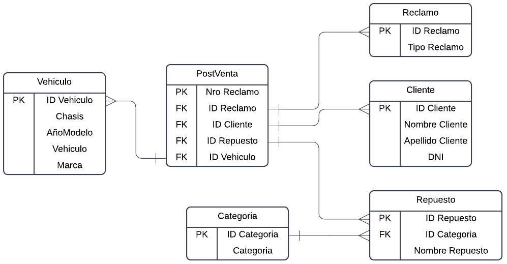

# Data-Analytics-Projects
The most outstanding projects of the Data Analytics Bootcamp at NEOLAND.

Hi! I'm Erik Eudave, a Data Analyst with experience in Python, Streamlit, R, SQL, PowerBI, Tableau and Machine Learning.
Here you'll find a collection of projects I've completed.

## Proyects

---

### 1. [Spotify-Analysis](Spotify-Analysis/) (Final Bootcamp Project)

- **Description**: An analysis exploring the relationship between the characteristics of the most popular songs across 73 countries. The project aims to identify global and regional trends in music preferences based on audio features such as danceability, energy, and tempo..
- **Machine Learning**: 
  - Utilized the **K-Means clustering algorithm** to group songs based on their audio features.
  - Applied **Principal Component Analysis (PCA)** for dimensionality reduction, enabling effective visualization of song clusters.
- **Tools**: 
  - **Python**: For data analysis and machine learning.
  - **Streamlit**: To create an interactive web application for visualizing the results.
  - **Libraries**: Pandas, NumPy, Scikit-learn, Matplotlib, Seaborn, Plotly, Folium, Json.
- **Results**: 
  - Identified that some songs and artists are popular across multiple countries, indicating global trends.
  - Discovered that certain songs are popular only in specific regions, highlighting cultural preferences.
  - Found that musical characteristics such as **danceability** and **energy** are key drivers of song popularity.
- **Achievements**: 
  - This project was selected as the **best project** within the Data Analytics Bootcamp, recognized for its innovative approach and impactful insights.
  
<!-- - **Live Demo**: [View the interactive Streamlit app here](#). -->

---

### 2. [PowerBI](PowerBI/)

- **Description**: - **Description**: Interactive dashboards developed in Power BI using DAX for advanced calculations, database connections, and custom visualizations. .
- **Tools**: PowerBI: DAX, DB Connection.
- **Results**: These dashboards provide actionable insights for sales analysis, financial reporting, and operational performance tracking.

---

### 3. [Tableau](Tableau/)

  
  

- **Description**: Interactive dashboards developed in Tableau using advanced calculations and custom visualizations.
- **Tools**: Tableau: Dimensions, Measurements and Maps.
- **Results**: Powerful visualizations that provide actionable insights for sales analysis, financial reporting, and operational performance tracking.

---

### 4. [Python](Python/)

- **Description**: **Description**: A collection of Python coding exercises focused on data manipulation, algorithm development, and data visualization.
- **Tools**: Python: Loops/Conditionals, Data Types, Objects, Matplotlib, Seaborn, Plotly, Pyodbc, NumPy, Pandas.
- **Results**: These exercises utilize libraries to solve real-world problems and improve programming skills enabling efficient data analysis and the creation of impactful visualizations.

---

### 5. [Machine Learning](Machine-Learning/)

- **Description**: Machine Learning code exercises in Python.
- **Tools**: Python: Pandas, NumPy, Matplotlib, Seaborn, StatsModels, SciPy, Sklearn.
- **Results**: Successfully generated and applied common Machine Learning models to solve real-world problems:
  - Linear/Logistic Regression
  - K-Means Clustering
  - K-Nearest Neighbors (KNN)
  - Decision Trees
  - Random Forest

---

### 6. [R](R/)

- **Description**: R programming exercises focusing on data manipulation, visualization, and statistical analysis.
- **Tools**: R: Readr, Dplyr, Tidyr, Stringr, Lubridate, Forecats, Ggplot, Plotly.
- **Results**: Achieved proficiency in R's main libraries, enabling efficient data analysis and impactful visualizations.

---

### 7. [SQL](SQL/)

- **Description**: SQL exercises designed to improve query writing and database management skills.
- **Tools**: DBeaver, Microsoft SQL Server Management Studio (SSMS), Lucid (ER Diagrams).
- **Results**: Achieved proficiency in writing efficient SQL queries and optimizing database performance, supporting data-driven decision-making.

---