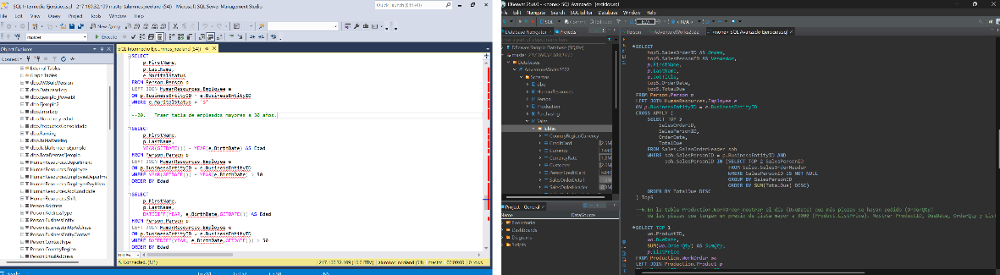
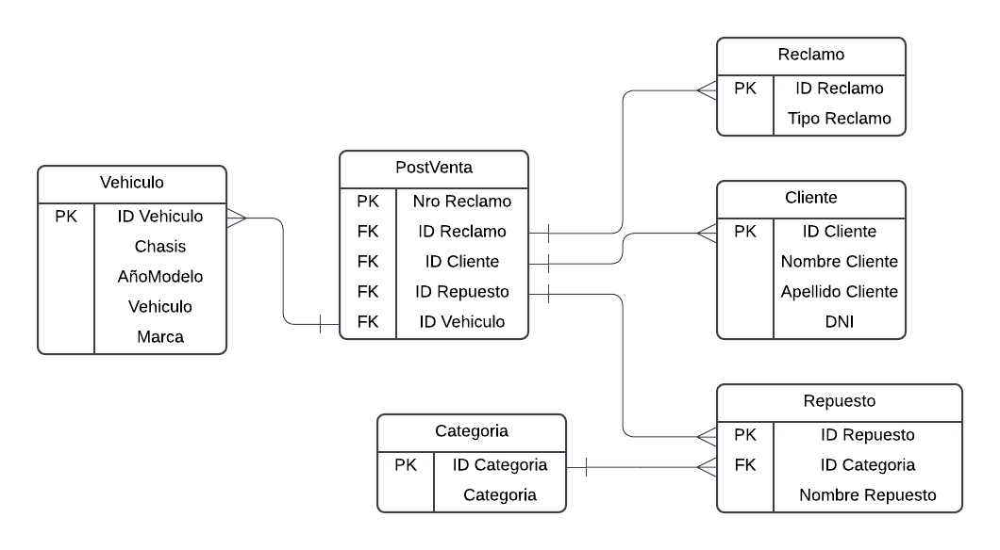

# SQL

	
	

### **Description**: SQL exercises designed to improve query writing and database management skills.
### **Tools**: DBeaver, Microsoft SQL Server Management Studio (SSMS), Lucid (ER Diagrams).
### **Results**: Achieved proficiency in writing efficient SQL queries and optimizing database performance, supporting data-driven decision-making.