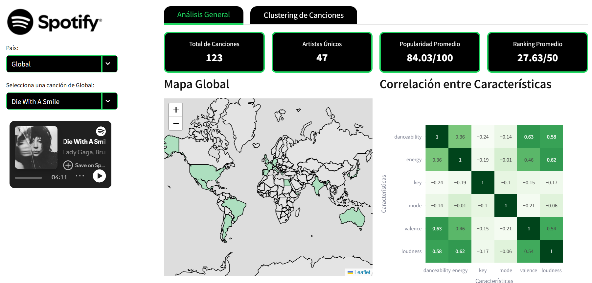
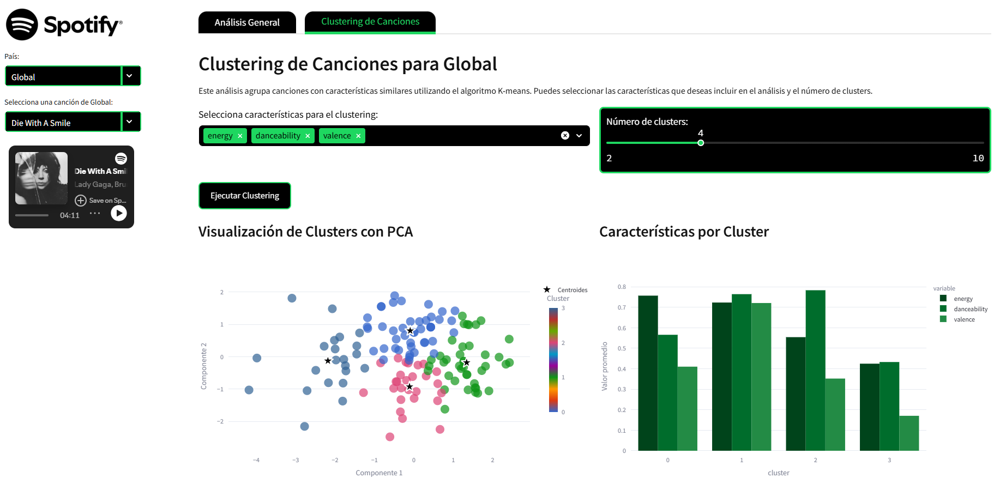

# Spotify Popularity Analysis

### **Description**: An analysis exploring the relationship between the characteristics of the most popular songs across 73 countries. The project aims to identify global and regional trends in music preferences based on audio features such as danceability, energy, and valence.

### **Live Demo**: 
  - [¡View the interactive Streamlit App Here!](https://data-analytics-spotify.streamlit.app)

### **Data source**: 
  - **Kaggle**: [Top Spotify Songs in 73 Countries (Daily Updated)](https://www.kaggle.com/datasets/asaniczka/top-spotify-songs-in-73-countries-daily-updated)
  - World's most popular songs on Spotify: Top 50 songs for each country is updated daily to provide the most up-to-date information on the popularity of songs in the world.

### **Machine Learning**: 
  - Utilized the **K-Means clustering algorithm** to group songs based on their audio features.
  - Applied **Principal Component Analysis (PCA)** for dimensionality reduction, enabling effective visualization of song clusters.

### **Tools**: 
  - **Python**: For data analysis and machine learning.
  - **Streamlit**: To create an interactive web application for visualizing the results.
  - **Libraries**: Pandas, NumPy, Scikit-learn, Matplotlib, Seaborn, Plotly, Folium, Json.

### **Results**: 
  - Identified that some songs and artists are popular across multiple countries, indicating global trends.
  - Discovered that certain songs are popular only in specific regions, highlighting cultural preferences.
  - Found that musical characteristics such as **danceability** and **energy** are key drivers of song popularity.

### **Achievements**: 
  - This project was selected as the **Best Project** within the Data Analytics Bootcamp, recognized for its innovative approach and impactful insights.

#### **Data Cleanup Notebook (Generates spotify_clean.csv file)**: [Cleanup_Spotify.ipynb](notebooks/Cleanup_Spotify.ipynb)
#### **World Map To Highlight Countries**: [custom.geo.json](https://geojson-maps.kyd.au/)
#### **Spotify Logo and Icon**: 

