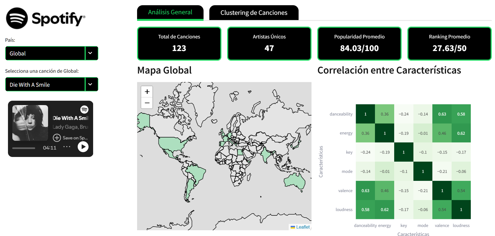
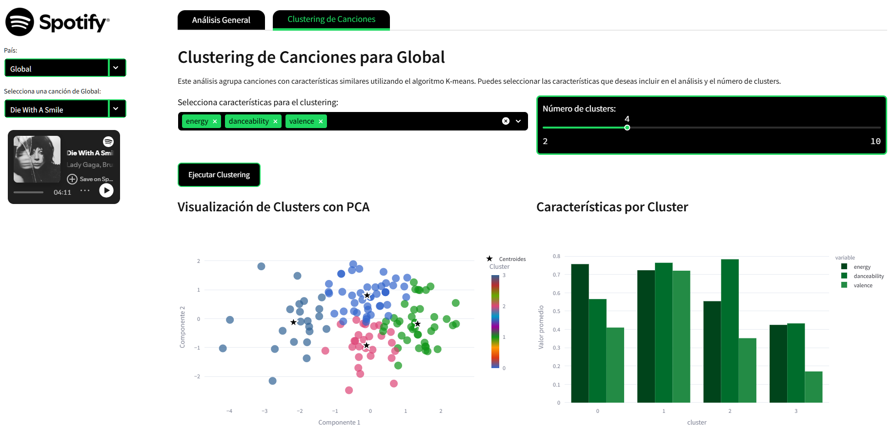

# Spotify Popularity Analysis

### **Description**: An analysis exploring the relationship between the characteristics of the most popular songs across 73 countries. The project aims to identify global and regional trends in music preferences based on audio features such as danceability, energy, and valence.

---

## 🚀 Live Demo  
- **Experience the interactive web application**:  

---

## 📊 Data Source  
- **Top Spotify Songs in 73 Countries (Daily Updated)**:  
    
- The dataset provides **daily updates** on the top 50 songs in each country, offering insights into **global and regional music trends**.

---

## 🤖 Machine Learning  
- Implemented **K-Means clustering** to group songs based on their audio features.  
- Applied **Principal Component Analysis (PCA)** to reduce dimensionality and enable **effective visualization** of song clusters.

---

## 🛠️ Tools & Technologies  
- **Python**: Used for data preprocessing, analysis, and machine learning.  
- **Streamlit**: Built an interactive web app for data visualization.  
- **Key Libraries**: Pandas, NumPy, Scikit-learn, Matplotlib, Seaborn, Plotly, Folium, JSON.  

---

## 📈 Key Results  
✔ **Identified global trends**: Some songs and artists dominate multiple countries.  
✔ **Discovered cultural preferences**: Certain songs are uniquely popular in specific regions.  
✔ **Analyzed musical characteristics**: Features like **danceability** and **energy** drive song popularity.  

---

## 🏆 Achievements  
This project was recognized as the **Best Project** in the Data Analytics Bootcamp for its **innovative approach and data-driven insights**.  

---

## 📂 Additional Resources  
📌 **Data Cleanup Notebook** _(Generates `spotify_clean.csv` file)_:  
[📄 Cleanup_Spotify.ipynb](notebooks/Cleanup_Spotify.ipynb)  

📌 **World Map for Country Highlighting**:  
[🗺️ custom.geo.json](https://geojson-maps.kyd.au/)  

📌 **Spotify Logo and Icon**:  
  

