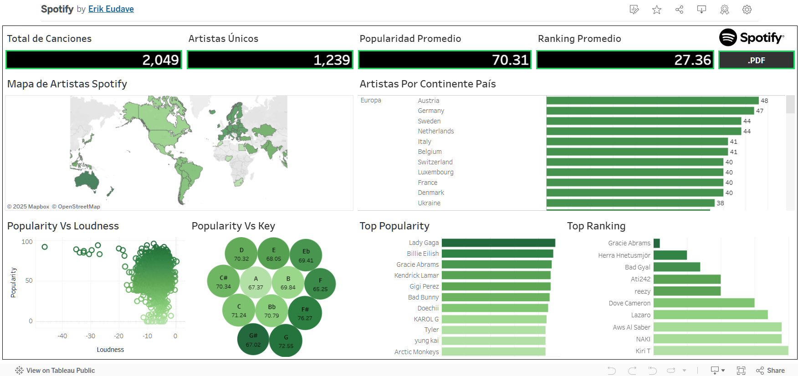
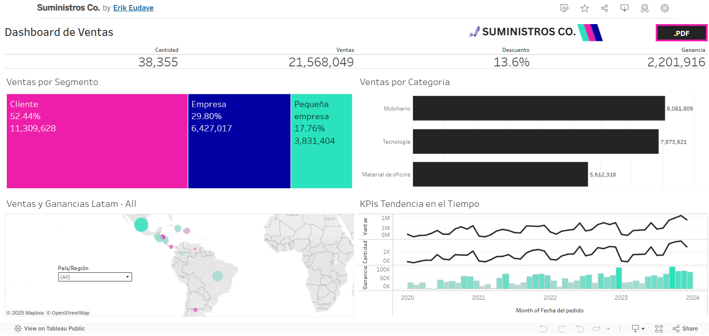
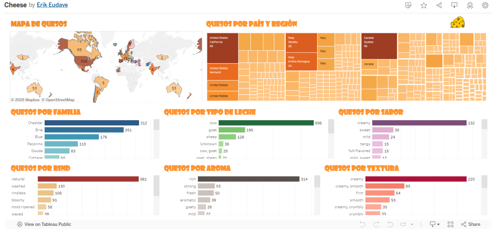

# Tableau

	
	
	

### **Description**: Interactive dashboards developed in Tableau using advanced calculations and custom visualizations.
### **Tools**: Tableau: Dimensions, Measurements and Maps.
### **Results**: Powerful visualizations that provide actionable insights for sales analysis, financial reporting, and operational performance tracking.

### **📊 My Tableau Profile**: 